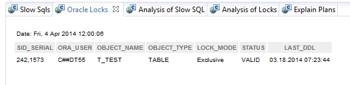
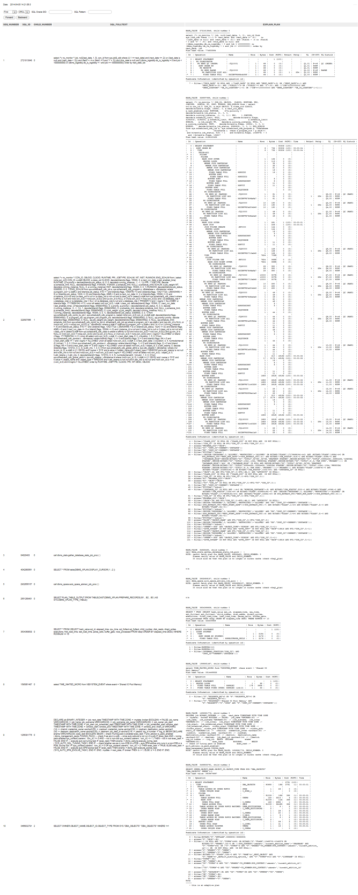

# Oracle Monitor Plugin

## Overview

The Oracle Monitor plugin enables monitoring the values provided in Oracle's v$ tables.The plugin uses JDBC to connect to the Oracle Database and queries the most important metrics from these tables.
Having these measures in dynaTrace enables quick correlation of database related performance issues such as high I/O or too many database connections to application transaction performance problems
such as long running transactions or slow database queries.

## Plugin Details

| Name | Oracle Monitor Plugin
| :--- | :---
| Author | Chuck Miller (chuck.miller@dynatrace.com) & Joe Hoffman (joe.hoffman@dynatrace.com)  
| | Thanks to Yakov Sobolev at JPMorgan Chase for helping add Service Name support to this plugin
| | Eugene Turetsky ([eugene.turetsky@compuware.com](mailto:eugene.turetsky@compuware.com)) Enhanced Oracle Monitor Plugin v. 1.0.9.
| Supported dynaTrace Versions | >= 5.5
| License | [dynaTrace BSD](dynaTraceBSD.txt)
| Support | [Not Supported](https://community.compuwareapm.com/community/display/DL/Support+Levels)
| Release History | 2010-06-30 1.0.5 Initial Release  
| | 2010-11-30 1.0.7 Updated for 3.5, handle reconnect after DB restart, improved logging  
| | 2011-06-06 1.0.8 Updated to handle the Oracle Thin Driver syntax for clustered databases which are using a Service name  
| | 2014-03-28 1.0.9 Added support for historical analysis of top N slow SQL statements, historical analysis of database locks, historical analysis of explain plans etc. (see [documentation](Database_Enhanced_Plugin_v._1.0.9.docx) for details)
| Download | [Enhanced Oracle Monitor Plugin 1.0.9](com.dynatrace.diagnostics.plugins.OraclePlugin_1.0.9.jar)
| | [Web UI war](SqlMVC.war) file for historical analysis of SQL statements, database locks,explain plans, etc. See section 3 of plugin 
| | [documentation](Oracle_Database_Enhanced_Plugin_v._1.0.9.docx) for instructions about deploying web UI application on the application server of choice.  
| | [Example of Oracle Monitor Dashboard](Oracle_Database_Dashboard.dashboard.xml)  
| | [DDL file with supporting tables for Web UI application](create_top_sqls_ddl.sql) for Oracle database  
| | [database.properties](database.properties) file  
| | [Documentation](Oracle_Database_Enhanced_Plugin_v._1.0.9.docx)

## Provided Measures

The following image shows the metrics that the monitor provides:

## New Capabilities of the Enhanced Oracle Monitor Plugin

Enhanced Oracle Monitor Plugin adds to the existing Oracle Monitor Plugin ability to gather statistics on the SQL level. It provides customers with the following statistics for every SQL statement:

  * SQL SID 

  * SQL Full Text 

  * Child Number 

  * Number of Executions 

  * Elapsed Time 

  * Average Elapsed Time 

  * CPU Time 

  * Average CPU Time 

  * Disk Reads 

  * Direct Writes 

  * Buffer Gets 

  * Rows Processed 

  * Parse Calls 

  * First Load Time 

  * Last Load Time 

For in-depth SQL analysis there is SQL explain plan which was captured at the time when this SQL statement was executed.

Besides detailed SQL level statistics there are stats about database locks, tablespaces (coming) etc. which give user additional information about state of the database. For database locks the
following information is captured:

  * Concatenation of the session_id from the gv$locked_object view and serial# from the v$session view 

  * Oracle User 

  * Object Name 

  * Object Type 

  * Lock Mode 

  * Status 

  * Last DDL Time 

Plugin keeps information in the performance warehouse (or in any external relational database) and hence allows going back in history to compare performance of the SQL in question over time. The Web
UI piece of the plugin handles getting historical data and allows performing analysis of the slow SQL statements, explain plans, locks, etc. historically.

Following screenshot contains top N SQL statements Dashlet:

Following screenshot contains Database Locks Dashlet:

Following screenshot contains Analysis Dashlet for top N SQL statements:

Following screenshot contains Explain Plans Dashlet taken at the time of SQL statement execution:

Following screenshot contains Analysis of Database Locks Dashlet:

Following screenshot shows list of dynamic measures which are gathered by the plugin for every top N SQL statement:

Following screenshot shows list of dynamic measures which are gathered by the plugin for every database lock:

  
Please see [documentation](attachments_161940484_1_Oracle_Database_Enhanced_Plugin_v._1.0.9.docx) of the Enhanced Oracle Monitor Plugin for more details.

## Deploying Enhanced Oracle Monitor Plugin and web UI application

Besides regular steps which are described for the previous versions of the Oracle Monitor Plugin in the "Configuration Oracle Monitor" section below, there are following deployment steps which need to
be done before Enhanced Oracle Monitor Plugin and web UI application can be used:

  1. Create supporting tables for the historical analysis: 

    1. Changing owner's placeholder name in the [create_top_sqls_ddl.sql](attachments_163546743_2_create_top_sqls_ddl.sql) script from "c##dt55" to a real name which will be used by the web UI application. 

    2. Execute the [create_top_sqls_ddl.sql](attachments_163546743_2_create_top_sqls_ddl.sql) script using Oracle sqlplus utility or SQL Developer. 

    3. Note that the [create_top_sqls_ddl.sql](attachments_163546743_2_create_top_sqls_ddl.sql) script is valid for Oracle database only. We will be posting shortly scripts for creation of the supporting tables for other databases like MS SQL, DB2, PostgreSQL, etc. 

  2. Change values of the ${db.url}, ${db.user}, and ${db.password} variables in the [database.properties](attachments_161939641_1_database.properties_file.png) file to the appropriate values. See database properties file below: 

  3. Set environmental variable "ext.prop.dir" to a directory where the database.properties file is located. For example, execute command  
"set ext.prop.dir=C:\Users\dmaext0\"  
on Windows OS to set directory value to C:\Users\dmaext0\\.  
_Note: _

    1. Do not forget to add "\" (backward slash) at the end of the directory name. On Unix systems use "/". 

    2. Make sure that user which owns application server process (e.g. Tomcat, Jetty, JBoss, etc.) where web UI application will be executed has read access to the database.properties file. 

  4. Use standard deployment procedure to deploy web UI war file on the application server of choice: 

  1. For Tomcat 7.0 the standard deployment procedure is described [here](https://tomcat.apache.org/tomcat-7.0-doc/appdev/deployment.html). One of the options to deploy war file (probably the easiest one) is to follow up steps from the following extract from the above article:  
_Copy the web application archive file into directory _`$CATALINA_BASE/webapps/`. When Tomcat is started, it will automatically expand the web application archive file into its unpacked form, and
execute the application that way. This approach would typically be used to install an additional application, provided by a third party vendor or by your internal development staff, into an existing
Tomcat installation. **NOTE** \- If you use this approach, and wish to update your application later, you must both replace the web application archive file **AND** delete the expanded directory that
Tomcat created, and then restart Tomcat, in order to reflect your changes.

See section 3 of the plugin [documentation](attachments_161940484_1_Oracle_Database_Enhanced_Plugin_v._1.0.9.docx) for more details about web UI war deployment process.

## Access privileges to the Oracle system tables and views for the Enhanced Oracle Monitor Plugin

Oracle user of the monitored database needs to have SELECT privileges for the following objects:

  1. v$buffer_pool_statistics 

  2. v$sysstat 

  3. v$librarycache 

  4. v$license 

  5. dba_objects 

  6. gv$locked_object 

  7. v$session 

  8. v$sql 

## Configuration Oracle Monitor

The monitor requires the following configuration settings:

  * hostName: Host name of the Oracle Database Instance 

  * dbName: Database Instance Name (SID) or Service name 

  * dbUsername: Username that is used to access the database. User needs to have query rights to v$ tables 

  * dbPassword: Password that is used to access the database 

  * dbPort: Oracle Database Port for JDBC Connections (default: 1521) 

## Installation

Import the Plugin into the dynaTrace Server via the dynaTrace Server Settings menu -> Plugins -> Install Plugin. For details how to do this please refer to the [dynaTrace
documentation](https://community.dynatrace.com/community/display/DOCDT32/Manage+and+Develop+Plugins#ManageandDevelopPlugins-ManageandDevelopPlugins).

To use the provided dashboard please leave the default name of the Monitor as "RepositoryDB", then open the Dashboard and set the Data Source accordingly.

## Access Requirements

This plugin accesses the following tables requiring only Connect and Resource roles.

  * v$buffer_pool_statistics 

  * v$sysstat 

  * v$librarycache 

  * v$license 

## Usage Notes

As of v1.0.8 the Thin Driver syntax is now supported which provides support for clustered databases which use a service name. The DBName (SID) syntax is also still supported.

